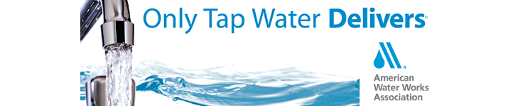

<!--
<a href="http://www.northshorewater.org/CCR2020.pdf" download>Click here to download PDF version</a>

* * * -->

* * *

# 2020 Annual Water Quality Report

<!-- The following text is for the newspaper publication only. -->
<!-- This report is available upon request to the public. For a paper copy, please contact your water utility or call (414) 963-0160. In addition to being published in this paper, the URL of the 2018 Annual Water Quality Report will be distributed by mail to water customers within the Village of Fox Point, City of Glendale, and Village of Whitefish Bay. -->

The North Shore Water Commission, in cooperation with its member utilities, publishes a water quality report annually. The report is designed so you can clearly understand what’s in your drinking water and how to obtain additional information. Thank you for being a valued customer!

* * *

## North Shore Water Commission

The North Shore Water Commission (NSWC) operates and maintains the Water Filtration Plant at 400 West Bender Road in Glendale as well as the Raw Water Pumping Station located in Whitefish Bay. The NSWC is responsible for purifying and pumping potable water to its member utilities which include Fox Point, Glendale, and Whitefish Bay. In addition, water is also provided to some areas served by Mequon Water Utility via a wholesale water agreement. If you want to know more about water quality or this report, please contact the Plant Manager at (414) 963-0160 or at [ekiefer@northshorewc.com](mailto:ekiefer@northshorewc.com).

* * *

## Water Utilities

Each water utility is responsible for connecting customers to the water system, metering water use, billing, and responding to distribution problems such as main breaks. You can find out who your water utility is by checking your water bill. If you experience a water-related problem or have questions about your water bill, please contact your water utility for assistance.

| [Fox Point Water Utility](http://www.villageoffoxpoint.com/) | [Glendale Water Utility](http://www.glendale-wi.org) | [Whitefish Bay Water Utility](http://www.wfbvillage.org) |
|:------------------------------------------------------------:|:----------------------------------------------------:|:--------------------------------------------------------:|
|                 |           |           |
|                        (414) 351-8900                        |                    (414) 228-1719                    |                      (414) 962-6690                      |

* * *

## Governance

Fox Point, Glendale, and Whitefish Bay jointly own the facilities of the North Shore Water Commission and share the costs of water production and facility improvements.

The NSWC is governed by three appointed Commissioners and three Alternates with equal representation from Fox Point, Glendale, and Whitefish Bay. Each member is appointed by his/her respective municipality for a term of one year. Annually, the responsibilities of Chairman, Secretary and Member are rotated giving each community equal share of authority.

Under normal circumstances, the NSWC convenes monthly and reviews the operation and maintenance of the water treatment facility as well as water quality concerns. After discussion, the NSWC votes on proposed action, spending, and budgets. Capital improvements, such as the UV disinfection upgrade, must be unanimously approved and financed by the member communities.

* * *

## Public Meetings

Regular meetings are usually held on the 2nd Wednesday of the month at 8:00 AM in the conference room located at 400 West Bender Road, Glendale. The public is welcome to attend any of our meetings. Please note that they may be held at different times or locations. You can view the agenda at [http://northshorewc.com/splash/meetings/](http://northshorewc.com/splash/meetings/) to find out more information about past or upcoming meetings. The agenda is typically posted 3 to 5 days prior to a meeting.

* * *

## More Information About Us

For additional information about water quality on the internet, please visit WDNR’s website at [http://dnr.wi.gov/topic/DrinkingWater](http://dnr.wi.gov/topic/DrinkingWater), the EPA’s web site at [http://www.epa.gov/safewater](http://www.epa.gov/safewater), or our web site at [http://www.northshorewc.com](http://www.northshorewc.com). For more information about our member communities visit: [http://www.villageoffoxpoint.com](http://www.villageoffoxpoint.com/), [http://www.glendale-wi.org](http://www.glendale-wi.org), and [http://www.wfbvillage.org](http://www.wfbvillage.org).

* * *

## Abbreviations and Definitions

| Term                                          | Abbreviation | Definition                                                                                                                                                                                                                                                    |
|:----------------------------------------------|:-------------|:--------------------------------------------------------------------------------------------------------------------------------------------------------------------------------------------------------------------------------------------------------------|
| Action Level                                  | AL           | The concentration of a contaminant which, if exceeded, triggers treatment or other requirements which a water system must follow.                                                                                                                             |
| Disinfection By-products                      | DBPs         | These are compounds that are formed when using a disinfectant.                                                                                                                                                                                                |
| United States Environmental Protection Agency | EPA          |                                                                                                                                                                                                                                                               |
| Haloacetic Acids Group HAA5                   | HAA5         | Monochloroacetic acid, dichloroacetic acid, trichloroacetic acid, monobromoacetic acid, and dibromoacetic acid. This is a class of disinfection by-products.                                                                                                  |
| Haloacetic Acids Group HAA6Br                 | HAA6Br       | Monobromoacetic acid, dibromoacetic acid, bromochloroacetic acid, bromodichloroacetic acid, chlorodibromoacetic acid, and tribromoacetic acid. This is a class of disinfection by-products.                                                                   |
| Haloacetic Acids Group HAA9                   | HAA9         | Monochloroacetic acid, dichloroacetic acid, trichloroacetic acid, monobromoacetic acid, dibromoacetic acid, bromochloroacetic acid, bromodichloroacetic acid, chlorodibromoacetic acid, and tribromoacetic acid. This is a class of disinfection by-products. |
| Locational Running Annual Average             | LRAA         | The average of four quarterly samples collected in one 12-month period at a specific sampling site.                                                                                                                                                           |
| Maximum Contaminant Level                     | MCL          | This is the highest level of a contaminant that is allowed in drinking water. MCLs are set as close to the MCLGs as feasible using the best available treatment technology.                                                                                   |
| Maximum Contaminant Level Goal                | MCLG         | This is the level of a contaminant in drinking water below which there is no known or expected risk to health. MCLGs allow for a margin of safety.                                                                                                            |
| Milligrams Per Liter                          | mg/L         | One milligram per liter corresponds to one minute in two years or a single penny in $10,000. Milligrams per liter is equivalent to the term parts per million (ppm).                                                                                          |
| Micrograms Per Liter                          | ug/l         | One part per billion corresponds to one minute in 2,000 years, or a single penny in $10,000,000. Micrograms per liter is equivalent to the term parts per billion (ppb).                                                                                      |
| Nephelometric Turbidity Unit                  | NTU          | Nephelometric turbidity unit is a measure of the clarity of water. Turbidity in excess of 5 NTU is just noticeable to the average person.                                                                                                                     |
| North Shore Water Commission                  | NSWC         |                                                                                                                                                                                                                                                               |
| Not Applicable                                | NA           | Not applicable.                                                                                                                                                                                                                                               |
| Not Detected                                  | ND           | Laboratory analysis indicates that the constituent is not present. In other words, the analyte was below the detection limit.                                                                                                                                 |
| Secondary Maximum Contaminant Level           | SMCL         | These levels are established as guidelines to assist public water systems in managing their drinking water for aesthetic considerations, such as taste, color, and odor. These contaminants are not considered to present a risk to human health at the SMCL. |
| Trihalomethanes                               | TTHM         | Chloroform, bromodichloromethane, dibromochloromethane, and bromoform. This is a class of disinfection by-products.                                                                                                                                           |
| Wisconsin Department of Natural Resources     | WDNR         |                                                                                                                                                                                                                                                               |

## Source Water Assessment

The North Shore Water Commission purifies water from Lake Michigan. The latest evaluation by the Wisconsin Department of Natural Resources (WDNR) indicates our source water quality is susceptible to pollution and contaminants. Preserving the water quality of Lake Michigan is essential to maintaining your drinking water quality. For more information on the impacts to your source of drinking water, see the Source Water Assessment for North Shore Water Commission at [http://northshorewater.org/images/materials/SWA-2002.pdf](http://northshorewater.org/images/materials/SWA-2002.pdf).

* * *

## Education Information

The sources of drinking water, both tap water and bottled water, include rivers, lakes, streams, ponds, reservoirs, springs and wells. As water travels over the surface of the land or through the ground, it dissolves naturally occurring minerals and, in some cases, radioactive material, and can pick up substances resulting from the presence of animals or from human activity. Contaminants that may be present in source water include the following.

> **Microbial contaminants**, such as viruses and bacteria, which may come from sewage treatment plants, septic systems, agricultural livestock operations and wildlife.

> **Inorganic contaminants**, such as salts and metals, which can be naturally-occurring or result from urban stormwater runoff, industrial or domestic wastewater discharges, oil and gas production, mining or farming.

> **Pesticides and herbicides**, which may come from a variety of sources such as agriculture, urban stormwater runoff and residential uses.

> **Organic chemical contaminants**, including synthetic and volatile organic chemicals, which are by-products of industrial processes and petroleum production, and can also come from gas stations, urban stormwater runoff and septic systems.

> **Radioactive contaminants**, which can be naturally occurring or be the result of oil and gas production and mining activities.

In order to ensure that tap water is safe to drink, EPA prescribes regulations that limit the amount of certain contaminants in water provided by public water systems. Food and Drug Administration regulations establish limits for contaminants in bottled water, which should provide the same protection for public health.

* * *

## Health Information

Drinking water, including bottled water, may reasonably be expected to contain at least small amounts of some contaminants. The presence of contaminants does not necessarily indicate that water poses a health risk. More information about contaminants and potential health effects can be obtained by calling the Environmental Protection Agency’s safe drinking water hotline at (800) 426-4791. Some people may be more vulnerable to contaminants in drinking water than the general population. Immuno-compromised persons such as persons with cancer undergoing chemotherapy, persons who have undergone organ transplants, people with HIV/AIDS or other immune systems disorders, some elderly, and infants can be particularly at risk from infections. These people should seek advice about drinking water from their health care providers. EPA/CDC guidelines on appropriate means to lessen the risk of infection by cryptosporidium and other microbial contaminants are available from the Environmental Protection Agency’s safe drinking water hotline.

### Lead Health Effects

Infants and children who drink water containing lead in excess of the action level could experience delays in their physical or mental development. Children could show slight deficits in attention span and learning abilities. Adults who drink this water over many years could develop kidney problems or high blood pressue.

### Additional Lead Information

If present, elevated levels of lead can cause serious health problems, especially for pregnant women and young children. Lead in drinking water is primarily from materials and components associated with service lines and home plumbing. North Shore Water Commission and your water utility are responsible for providing high quality drinking water, but cannot control the variety of materials used in plumbing components. When your water has been sitting for several hours, you can minimize the potential for lead exposure by flushing your tap for 3 minutes before using water for drinking or cooking. If you are concerned about lead in your water, you may wish to have your water tested. Information on lead in drinking water, testing methods, and steps you can take to minimize exposure is available from the Safe Drinking Water Hotline or at [http://www.epa.gov/safewater/lead](http://www.epa.gov/safewater/lead).

The North Shore Health Department is another valuable resource. They can provide you with more information about the health effects of lead and how to test for lead in your home. Visit their website at [http://www.nshealthdept.org](http://www.nshealthdept.org) or call (414) 371-2980.

* * *

## Treatment Process

Our treatment process starts when water enters our intake crib located in Lake Michigan. Bar screens prevent large objects from entering the intake, and a mussel control system prevents zebra and quagga mussels from accumulating in our pipes and equipment.

Gravity forces the water to fill a large shorewell that has several raw water pumps submersed in it. After passing through another screen, lake water is pumped from this station to the main treatment plant.

Upon arriving at the main facility, aluminum sulfate (alum) and polymer are added to promote settling of solids. This water then travels very slowly through a system of rectangular basins that provide a location for particulate matter to accumulate.

Rapid sand filters remove the remaining particulate matter and clean water is stored in a clearwell below the filters. There are intermediate pumps (sometimes referred to as transfer or low lift pumps) which force the filtered water through a fully redundant ultraviolet (UV) disinfection system which inactivates pathogens such as cryptosporidium. Before entering the UV reactors, fluoride is added to the water to prevent tooth decay. After passing through the UV reactors, sodium hypochlorite (a form of chlorine) is added to the water to disinfect any remaining pathogens.

Underground piping directs the water to our chlorine contact-time clearwells. While in these clearwells, chlorine has sufficient time to disinfect the water.

Our high service pumps draws water from these clearwells into a chemical feed vault where ammonium hydroxide (also referred to as aqua ammonia) and phosphate are added. The ammonium hydroxide converts the chlorine to another disinfectant, chloramine, that is used by neighboring communities and can reduce disinfection by-products formation in the distribution system. Phosphate is also added at this point to reduce lead and copper leaching within pipes and plumbing fixtures in your home.

Water leaving the main facility is metered as it enters the mains of the member communities. Within the distribution systems of Fox Point, Glendale, and Whitefish Bay, there are metered interconnections that are kept open to improve pressure and water quality. The NSWC also reads and maintains these meters.

* * *

## Officials

Please note that officers from the member communities rotate positions annually at the May meeting.

### Fox Point

| Office       | Office Holder | Email                                                                   | Phone          |
|:-------------|:--------------|:------------------------------------------------------------------------|:---------------|
| Chair        | Scott Botcher | [sbotcher@villageoffoxpoint.com](mailto:sbotcher@villageoffoxpoint.com) | (414) 351-8900 |
| Alternate    | Karen Shapiro | [shapirokaren@gmail.com](mailto:shapirokaren@gmail.com)                 | (414) 351-8900 |
| Fiscal Agent | Kelly Meyer   | [KMeyer@villageoffoxpoint.com](mailto:KMeyer@villageoffoxpoint.com)     | (414) 351-8900 |

### Glendale

| Office    | Office Holder   | Email                                                           | Phone          |
|:----------|:----------------|:----------------------------------------------------------------|:---------------|
| Secretary | Charlie Imig    | [c.imig@glendale-wi.gov](mailto:c.imig@glendale-wi.gov)         | (414) 228-1710 |
| Alternate | Rachel Safstrom | [R.Safstrom@glendale-wi.gov](mailto:R.Safstrom@glendale-wi.gov) | (414) 228-1705 |

<!-- | Fiscal Agent | Shawn Lanser    | [S.Lanser@glendale-wi.gov](mailto:S.Lanser@glendale-wi.gov)     | (414) 228-1717 | -->

### Whitefish Bay

| Office    | Office Holder | Email                                                         | Phone          |
|:----------|:--------------|:--------------------------------------------------------------|:---------------|
| Member    | John Edlebeck | [j.edlebeck@wfbvillage.org](mailto:j.edlebeck@wfbvillage.org) | (414) 962-6690 |
| Alternate | Paul Boening  | [p.boening@wfbvillage.org](mailto:p.boening@wfbvillage.org)   | (414) 962-6690 |

* * *

## Cryptosporidium Monitoring

Cryptosporidium is a microscopic protozoan that, when ingested, can result in diarrhea, fever, and other gastrointestinal symptoms. The organism is found in many surface water sources (lakes, rivers, streams) and comes from human and animal wastes in the watershed. The NSWC uses an effective treatment process that is designed to remove and inactivate this pathogen. In 2020, cryptosporidium was not monitored.

* * *

## Turbidity

In accordance with s. NR 810.29, Wisconsin Administrative Code, the treated surface water is monitored for turbidity to confirm that the filtered water is less than 0.30 NTU. Turbidity is a measure of the cloudiness of water. We monitor for turbidity because it is a good indicator of the effectiveness of our filtration system. During the year, the highest single turbidity measurement in our combined filter effluent was 0.26 NTU. The lowest monthly percentage of samples meeting the turbidity limits was 100 percent.

* * *

## Regulatory Compliance

We are proud to report that our system has not violated a maximum contaminant level or any other water quality standard. The following tables list the contaminants that were detected. This report may contain up to five years worth of water quality results. If tested annually, or more frequently, the results from the most recent year are shown on this report. If testing is done less frequently, the results are shown from the most recent testing event. The NSWC and its member water utilities are allowed to test for some contaminants less frequently than once per year.

Please note that the term "level found" is used throughout this report. The meaning of "level found" will vary depending on how many samples were collected in a year and the particular regulation it pertains to. If a contaminant was tested once in a year, a single value will be reported as "level found." If contaminant was tested more than one time during the year, the minimum and maximum values (range) will be reported below the level found in parentheses.

* * *

### Monitoring Results Pertaining to the North Shore Water Commission (PWS# 24135155)

The NSWC and its member utilities work together to ensure the water it delivers meets or exceeds all water quality standards set forth by its regulatory agencies. The following sections show the contaminants that were detected by the NSWC in its monitoring. Please note that we did not test for radon during 2020 because we were not required to.

*Inorganic*

| Substance       | &nbsp;&nbsp;&nbsp;MCLG&nbsp;&nbsp;&nbsp; | &nbsp;&nbsp;&nbsp;MCL &nbsp;&nbsp;&nbsp;&nbsp; |          Level Found          |                   Status                    | Sources of Contamination                                                                                                                 |
|:----------------|:----------------------------------------:|:----------------------------------------------:|:-----------------------------:|:-------------------------------------------:|:-----------------------------------------------------------------------------------------------------------------------------------------|
| Arsenic    [2020]       |                    NA                    |                    10 ug/L                     |  0.6 ug/L   (0.5 - 0.7)   | &#9786; | Erosion of natural deposits; Runoff from orchards; Runoff from glass and electronics production wastes                                   |
| Barium     [2020]           |                  2 mg/L                  |                     2 mg/L                     |          0.020 mg/L           | &#9786; | Discharge of drilling wastes; discharge from metal refineries; erosion of natural deposits                                               |
| [^1] Fluoride      [2020]   |                  4 mg/L                  |                     4 mg/L                     | 0.73 mg/L   (0.65 - 0.78) | &#9786; | Erosion of natural deposits; Water additive which promotes strong teeth; discharge from fertilizer and aluminum factories                |
| Nickel     [2020]           |                 100 ug/L                 |                    100 ug/L                    |           0.54 ug/L           | &#9786; | Nickel occurs naturally in soils, groundwater and surface waters and is often used in electroplating, stainless steel and alloy products |
| Nitrate (NO3-N)     [2020]  |                 10 mg/L                  |                    10 mg/L                     |           0.36 mg/L           | &#9786; | Runoff from fertilizer use; Leaching from septic tanks, sewage; erosion of natural deposits                                              |
| Sodium     [2020]           |                    NA                    |                       NA                       |           9.6 mg/L            | &#9786; | NA                                                                                                                                       |

*Synthetic Organic Contaminants including Pesticides and Herbicides*

| Substance | MCLG | MCL | Level Found |                   Status                    | Sources of Contamination                 |
|:----------|:----:|:---:|:-----------:|:-------------------------------------------:|:-----------------------------------------|
| Atrazine     [2020]   |  3   |  3  | 0.024 ug/L  | &#9786; | Runoff from herbicide used on row crops. |

*Unregulated Contaminants*

Unregulated contaminants are those for which EPA has not established drinking water standards. The purpose of unregulated contaminant monitoring is to assist EPA in determining the occurrence of unregulated contaminants in drinking water and whether future regulation is warranted. EPA required us to participate in this monitoring.

| Substance          | MCLG | MCL |           Level Found            | Status                                      |
|:-------------------|:----:|:---:|:--------------------------------:|:--------------------------------------------|
| Sulfate     [2020]             |  NA  | NA  |            25.0 mg/L             | &#9786; |
| Metolachlor (DUAL)     [2020]   |  NA  | NA  | 0.016 ug/L   (0.012 - 0.020) | &#9786; |

* * *

### Monitoring Results Pertaining to the Village of Fox Point (PWS# 24105840)

The following table show the contaminants that were detected by the Village of Fox Point in its monitoring.

*Disinfection By-Products*

For monitoring location SSS-9:

| Substance | &nbsp;&nbsp;&nbsp;MCLG&nbsp;&nbsp; | &nbsp;&nbsp;&nbsp;MCL &nbsp;&nbsp;&nbsp; | Level Found |                   Status                    | Sources of Contamination                  |
|:----------|:----------------------------------:|:----------------------------------------:|:-----------:|:-------------------------------------------:|:------------------------------------------|
| HAA5      [2020]      |              60 ug/L               |                 60 ug/L                  |  9.3 ug/L   | &#9786; | By-product of drinking water chlorination |
| TTHM      [2020]      |                 0                  |                 80 ug/L                  |  13.0 ug/L  | &#9786; | By-product of drinking water chlorination |

For monitoring location SSS-10:

| Substance | &nbsp;&nbsp;&nbsp;MCLG&nbsp;&nbsp; | &nbsp;&nbsp;&nbsp;MCL &nbsp;&nbsp;&nbsp; | Level Found |                   Status                    | Sources of Contamination                  |
|:----------|:----------------------------------:|:----------------------------------------:|:-----------:|:-------------------------------------------:|:------------------------------------------|
| HAA5      [2020]      |              60 ug/L               |                 60 ug/L                  |  8.6 ug/L   | &#9786; | By-product of drinking water chlorination |
| TTHM      [2020]      |                 0                  |                 80 ug/L                  |  11.9 ug/L  | &#9786; | By-product of drinking water chlorination |

*Lead and Copper*

Please note that lead and copper do not have a maximum contaminant level. Instead they have an action level (AL). To determine compliance with the Lead and Copper Rule, all results collected from monitoring event are arranged lowest to highest and the 90th percentile value is determined. If the 90th percentile value is at or below the AL, no additional action is required[^2]. This process is applied for each water system.

Please note that "level found" in this section is the 90th percentile value from the latest monitoring event. **Of the 30 samples collected in 2020, 3 of the lead samples exceeded the action level of 15 ppb** and 0 of the copper samples exceeded the action level 1.3 ppm.

| Substance |   MCLG   |    AL    |                      Level Found                       |                   Status                    | Sources of Contamination                                                                            |
|:----------|:--------:|:--------:|:------------------------------------------------------:|:-------------------------------------------:|:----------------------------------------------------------------------------------------------------|
| Copper      [2020]    | 1.3 mg/L | 1.3 mg/L | 0.082 mg/L   (0.002 mg/L to 0.280 mg/L) | &#9786; | Corrosion of household plumbing systems; erosion of natural deposits; leach from wood preservatives |
| Lead      [2020]      |    0     | 15 ug/L  |     12.0 ug/L    (0.05 to 23 ug/L)      | &#9786; | Corrosion of household plumbing systems; erosion of natural deposits.                               |

To reduce the amount of lead that can transfer from lead-bearing fixtures and pipes to the water, the NSWC feeds a corrosion inhibitor that contains phosphate. The addition of phosphate has been determined by the EPA and WNDR to be one of the best available treatment processes for controlling lead in the distribution system.

*Uncorrected Significant Deficiencies*

WDNR notified the Fox Point Water Utility that it is not implementing a comprehensive Cross-Connection Control Program. They were notified about this deficiency on 9/30/2019 and must correct the deficiency by 9/30/2021. The Village is working on the required cross connection inspections and will correct any deficiencies identified by the WDNR by the deadline.

* * *

### Monitoring Results Pertaining to the City of Glendale (PWS# 24101682)

The following table show the contaminants that were detected by the City of Glendale in its monitoring.

*Disinfection By-Products*

Please note that "level found" in this section is the LRAA. This value can include data from a previous year.

For monitoring location SSS-03:

| Substance | &nbsp;&nbsp;&nbsp;MCLG&nbsp;&nbsp; | &nbsp;&nbsp;&nbsp;MCL &nbsp;&nbsp;&nbsp; |         Level Found          |                   Status                    | Sources of Contamination                  |
|:----------|:----------------------------------:|:----------------------------------------:|:----------------------------:|:-------------------------------------------:|:------------------------------------------|
| HAA5     [2020]       |              60 ug/L               |                 60 ug/L                  | 9.1 ug/L   (7.1 - 10.0)  | &#9786; | By-product of drinking water chlorination |
| TTHM     [2020]       |                 0                  |                 80 ug/L                  | 15.9 ug/L   (8.8 - 20.4) | &#9786; | By-product of drinking water chlorination |

For monitoring location SSS-16:

| Substance | &nbsp;&nbsp;&nbsp;MCLG&nbsp;&nbsp; | &nbsp;&nbsp;&nbsp;MCL &nbsp;&nbsp;&nbsp; |         Level Found          |                   Status                    | Sources of Contamination                  |
|:----------|:----------------------------------:|:----------------------------------------:|:----------------------------:|:-------------------------------------------:|:------------------------------------------|
| HAA5     [2020]       |              60 ug/L               |                 60 ug/L                  | 10.0 ug/L   (6.9 - 10.4) | &#9786; | By-product of drinking water chlorination |
| TTHM      [2020]      |                 0                  |                 80 ug/L                  | 16.2 ug/L   (7.9 - 21.2) | &#9786; | By-product of drinking water chlorination |

*Lead and Copper*

Please note that lead and copper do not have a maximum contaminant level. Instead they have an action level (AL). To determine compliance with the Lead and Copper Rule, all results collected from monitoring event are arranged lowest to highest and the 90th percentile value is determined. If the 90th percentile value is at or below the AL, no additional action is required[^2]. This process is applied for each water system.

Please note that "level found" in this section is the 90th percentile value from the latest monitoring event. **Of the 33 samples collected in 2020, 0 of the lead samples exceeded the action level of 15 ppb** and 0 of copper samples exceeded the action level 1.3 ppm.

| Substance |   MCLG   |    AL    |                      Level Found                       |                   Status                    | Sources of Contamination                                                                            |
|:----------|:--------:|:--------:|:------------------------------------------------------:|:-------------------------------------------:|:----------------------------------------------------------------------------------------------------|
| Copper     [2020]     | 1.3 mg/L | 1.3 mg/L | 0.029 mg/L   (0.001 mg/L to 0.100 mg/L) | &#9786; | Corrosion of household plumbing systems; erosion of natural deposits; leach from wood preservatives |
| Lead      [2020]      |    0     | 15 ug/L  |      5.3 ug/L    (ND to 7.4 ug/L)       | &#9786; | Corrosion of household plumbing systems; erosion of natural deposits.                               |

To reduce the amount of lead that can transfer from lead-bearing fixtures and pipes to the water, the NSWC feeds a corrosion inhibitor that contains phosphate. The addition of phosphate has been determined by the EPA and WNDR to be one of the best available treatment processes for controlling lead in the distribution system.

*Fourth Unregulated Contaminant Monitoring Rule*

THIS SECTION PERTAINS TO THE FOURTH ROUND of the UCMR. These compounds are not regulated (unless noted otherwise), and therefore, have no additional reporting and/or treatment requirements. Glendale was selected by EPA to conduct this testing in 2018 and 2019.

Please note that "level found" is the average level during the calendar year.

| Substance | [^4] SMCL |        Level Found         |                   Status                    | Additional Information                                                                                                                                                                                                     |
|:----------|:---------:|:--------------------------:|:-------------------------------------------:|:---------------------------------------------------------------------------------------------------------------------------------------------------------------------------------------------------------------------------|
| Manganese     [2018-2019]   |  50 ug/L  | 1.0 ug/L   (0.5 - 2.0) | &#9786; | Naturally-occurring element; commercially available in combination with other elements and minerals; a byproduct of zinc ore processing; used in infrared optics, fiber-optic systems, electronics and solar applications. |

For monitoring location SSS-03:

| Substance |  MCLG   |   MCL   |          Level Found          |                   Status                    | Additional Information                     |
|:----------|:-------:|:-------:|:-----------------------------:|:-------------------------------------------:|:-------------------------------------------|
| HAA5   [2018-2019]      | 60 ug/L | 60 ug/L |  8.9 ug/L   (6.2 - 14.0)  | &#9786; | By-product of drinking water chlorination. |
| HAA6Br   [2018-2019]    |   NA    |   NA    |  7.0 ug/L    (6.0 - 7.7)  | &#9786; | By-product of drinking water chlorination. |
| HAA9   [2018-2019]      |   NA    |   NA    | 14.4 ug/L   (11.2 - 18.8) | &#9786; | By-product of drinking water chlorination. |

For monitoring location SSS-16:

| Substance |  MCLG   |   MCL   |          Level Found          |                   Status                    | Additional Information                     |
|:----------|:-------:|:-------:|:-----------------------------:|:-------------------------------------------:|:-------------------------------------------|
| HAA5   [2018-2019]      | 60 ug/L | 60 ug/L |  9.4 ug/L   (6.7 - 13.9)  | &#9786; | By-product of drinking water chlorination. |
| HAA6Br   [2018-2019]   |   NA    |   NA    |  8.1 ug/L   (6.4 - 10.6)  | &#9786; | By-product of drinking water chlorination. |
| HAA9    [2018-2019]     |   NA    |   NA    | 15.8 ug/L   (12.1 - 21.3) | &#9786; | By-product of drinking water chlorination. |

The following is a complete list of compounds that were tested under this regulation:

> Bromochloroacetic acid, bromodichloroacetic acid, chlorodibromoacetic acid, dibromoacetic acid, dichloroacetic acid, monobromoacetic acid, monochloroacetic acid, tribromoacetic acid, trichloroacetic acid, germanium, manganese, alpha-hexachlorocyclohexane, chlorpyrifos, dimethipin, ethoprop, oxyfluorfen, profenofos, tebuconazole, total permethrin (cis & trans), tribufos, 1-butanol, 2-methoxyethanol, 2-propen-1-ol, butylated hydroxyanisole, o-toluidine, quinoline, total microcystins, microcystin-LA, microcystin-LF, microcystin-LR, microcystin-LY, microcystin-RR, microcystin-YR, nodularin, anatoxin-a, cylindrospermopsin.

*Other Unregulated Contaminants*

Unregulated contaminants are those for which EPA has not established drinking water standards. The purpose of unregulated contaminant monitoring is to assist EPA in determining the occurrence of unregulated contaminants in drinking water and whether future regulation is warranted. EPA required us to participate in this monitoring.

| Substance           | MCLG | MCL | Level Found | Status                                      |
|:--------------------|:----:|:---:|:-----------:|:--------------------------------------------|
| Bromomethane   [2017]  |  NA  | NA  |  0.73 ug/L  | &#9786; |

* * *

### Monitoring Results Pertaining to the Village of Whitefish Bay (PWS# 24105972)

The following table lists the contaminants that were detected by the Village of Whitefish Bay in its monitoring.

*Disinfection By-Products*

Please note that "level found" in this section is the LRAA. This value can include data from a previous year.

For monitoring location SSS-01:

| Substance | &nbsp;&nbsp;&nbsp;MCLG&nbsp;&nbsp; | &nbsp;&nbsp;&nbsp;MCL &nbsp;&nbsp;&nbsp; |         Level Found          |                   Status                    | Sources of Contamination                  |
|:----------|:----------------------------------:|:----------------------------------------:|:----------------------------:|:-------------------------------------------:|:------------------------------------------|
| HAA5   [2020]      |              60 ug/L               |                 60 ug/L                  |  8.7 ug/L   (6.9 - 9.7)  | &#9786; | By-product of drinking water chlorination |
| TTHM   [2020]      |                 0                  |                 80 ug/L                  | 15.6 ug/L   (8.6 - 20.4) | &#9786; | By-product of drinking water chlorination |

For monitoring location SSS-02:

| Substance | &nbsp;&nbsp;&nbsp;MCLG&nbsp;&nbsp; | &nbsp;&nbsp;&nbsp;MCL &nbsp;&nbsp;&nbsp; |         Level Found          |                   Status                    | Sources of Contamination                  |
|:----------|:----------------------------------:|:----------------------------------------:|:----------------------------:|:-------------------------------------------:|:------------------------------------------|
| HAA5   [2020]      |              60 ug/L               |                 60 ug/L                  |  8.7 ug/L   (6.6 - 9.4)  | &#9786; | By-product of drinking water chlorination |
| TTHM   [2020]      |                 0                  |                 80 ug/L                  | 15.9 ug/L   (8.6 - 20.4) | &#9786; | By-product of drinking water chlorination |

*Lead and Copper*

Please note that lead and copper do not have a maximum contaminant level. Instead they have an action level (AL). To determine compliance with the Lead and Copper Rule, all results collected from monitoring event are arranged lowest to highest and the 90th percentile value is determined. If the 90th percentile value is at or below the AL, no additional action is required[^2]. This process is applied for each water system.

Please note that "level found" in this section is the 90th percentile value from the latest monitoring event. **Of the 33 samples collected, 1 of the lead samples exceeded the action level of 15 ppb** and 0 of the copper samples exceeded the action level 1.3 ppm.

| Substance |   MCLG   |    AL    |                      Level Found                       |                   Status                    | Sources of Contamination                                                                            |
|:----------|:--------:|:--------:|:------------------------------------------------------:|:-------------------------------------------:|:----------------------------------------------------------------------------------------------------|
| Copper    [2020]   | 1.3 mg/L | 1.3 mg/L | 0.045 mg/L   (0.001 mg/L to 0.160 mg/L) | &#9786; | Corrosion of household plumbing systems; erosion of natural deposits; leach from wood preservatives |
| Lead     [2020]    |    0     | 15 ug/L  |     7.3 ug/L    (0.04 to 16.0 ug/L)     | &#9786; | Corrosion of household plumbing systems; erosion of natural deposits.                               |

To reduce the amount of lead that can transfer from lead-bearing fixtures and pipes to the water, the NSWC feeds a corrosion inhibitor that contains phosphate. The addition of phosphate has been determined by the EPA and WNDR to be one of the best available treatment processes for controlling lead in the distribution system.

*Fourth Unregulated Contaminant Monitoring Rule*

THIS SECTION PERTAINS TO THE FOURTH ROUND of the UCMR. These compounds are not regulated (unless noted otherwise), and therefore, have no additional reporting and/or treatment requirements. Whitefish Bay was selected by EPA to conduct this testing in 2018 and 2019.

Please note that "level found" is the average level during the calendar year.

| Substance | [^4] SMCL |        Level Found         |                   Status                    | Additional Information                                                                                                                                                                                                     |
|:----------|:---------:|:--------------------------:|:-------------------------------------------:|:---------------------------------------------------------------------------------------------------------------------------------------------------------------------------------------------------------------------------|
| Manganese   [2018-2019] |  50 ug/L  | 1.1 ug/L   (0.6 - 2.2) | &#9786; | Naturally-occurring element; commercially available in combination with other elements and minerals; a byproduct of zinc ore processing; used in infrared optics, fiber-optic systems, electronics and solar applications. |

For monitoring location SSS-01:

| Substance |  MCLG   |   MCL   |          Level Found          |                   Status                    | Additional Information                     |
|:----------|:-------:|:-------:|:-----------------------------:|:-------------------------------------------:|:-------------------------------------------|
| HAA5   [2018-2019]     | 60 ug/L | 60 ug/L |  8.6 ug/L   (5.7 - 13.5)  | &#9786; | By-product of drinking water chlorination. |
| HAA6Br   [2018-2019]   |   NA    |   NA    |  7.1 ug/L    (5.7 - 9.7)  | &#9786; | By-product of drinking water chlorination. |
| HAA9   [2018-2019]     |   NA    |   NA    | 14.8 ug/L   (11.0 - 22.3) | &#9786; | By-product of drinking water chlorination. |

For monitoring location SSS-02:

| Substance |  MCLG   |   MCL   |          Level Found          |                   Status                    | Additional Information                     |
|:----------|:-------:|:-------:|:-----------------------------:|:-------------------------------------------:|:-------------------------------------------|
| HAA5   [2018-2019]     | 60 ug/L | 60 ug/L |  8.7 ug/L   (6.3 - 13.5)  | &#9786; | By-product of drinking water chlorination. |
| HAA6Br   [2018-2019]   |   NA    |   NA    |  7.6 ug/L   (6.4 - 9.8)   | &#9786; | By-product of drinking water chlorination. |
| HAA9    [2018-2019]    |   NA    |   NA    | 15.4 ug/L   (11.5 - 22.3) | &#9786; | By-product of drinking water chlorination. |

The following is a complete list of compounds that were tested under this regulation:

> Bromochloroacetic acid, bromodichloroacetic acid, chlorodibromoacetic acid, dibromoacetic acid, dichloroacetic acid, monobromoacetic acid, monochloroacetic acid, tribromoacetic acid, trichloroacetic acid, germanium, manganese, alpha-hexachlorocyclohexane, chlorpyrifos, dimethipin, ethoprop, oxyfluorfen, profenofos, tebuconazole, total permethrin (cis & trans), tribufos, 1-butanol, 2-methoxyethanol, 2-propen-1-ol, butylated hydroxyanisole, o-toluidine, quinoline, total microcystins, microcystin-LA, microcystin-LF, microcystin-LR, microcystin-LY, microcystin-RR, microcystin-YR, nodularin, anatoxin-a, cylindrospermopsin.

*Other Unregulated Contaminants*

Unregulated contaminants are those for which EPA has not established drinking water standards. The purpose of unregulated contaminant monitoring is to assist EPA in determining the occurrence of unregulated contaminants in drinking water and whether future regulation is warranted. EPA required us to participate in this monitoring.

| Substance          | MCLG | MCL | Level Found | Status                                      |
|:-------------------|:----:|:---:|:-----------:|:--------------------------------------------|
| Naphthalene   [2017] |  NA  | NA  |  0.28 ug/L  | &#9786; |

*Uncorrected Significant Deficiencies*

WDNR notified the Whitefish Bay Water Utility of the following deficiencies.	They were notified about these deficiencies on 12/2/2019 and must correct the deficiencies by 9/30/2021.

* The overflow pipe of the Village of Whitefish Bay elevated water storage tank is not provided with a sufficient 4 mesh non corrodible screen and/or ground level overflow is not provided with a sufficient 24 mesh non corrodible screen.
* The overflow pipe of the Village of Whitefish Bay elevated water storage tank is not brought down to within 12 inches of the ground surface and discharged with a free air break over a drainage inlet structure.

The Village is working on making the required changes to the overflow pipe at the elevated storage tank and will correct any deficiencies identified by the WDNR by the deadline.

* * *

## Staff of the Commission

Eric Kiefer has been the Plant Manager since 2007. He received a Bachelor of Science degree with a major in chemistry from the University of Wisconsin Oshkosh as well as a Master of Business Administration degree from Marquette University. All full-time staff that participate in operations, including Mr. Kiefer, have a WDNR Municipal Waterworks Operator Certification. If you have a question regarding your water quality, please contact Mr. Kiefer at [ekiefer@northshorewc.com](mailto:ekiefer@northshorewc.com) or (414) 963-0160.

* * *

## Associations

The NSWC is a proud member of the following associations:

| Association                                                                         | Logo                                                               |
|:------------------------------------------------------------------------------------|:-------------------------------------------------------------------|
| [American Water Works Association](https://www.awwa.org/)                           |                             |
| [Wisconsin Section of the American Water Works Association](http://www.wiawwa.org/) |  |
| [The Water Council](http://thewatercouncil.com/)                                    |           |
| [Water Research Foundation](http://www.waterrf.org/)                                |         |
| [West Shore Water Producers Association](http://www.westshorewater.org/)            | 
West Shore Water Producers Association
            |

* * *

[^1]: "Level found" is the average level during the calendar year. Fluoride is tested throughout the year, the results shown include an annual test and 12 monthly split samples.

[^2]: Ten percent (10%) of the results are at or above the 90th percentile and ninety percent (90%) of the samples are below.

[^3]: The sum of these compounds is equal to TTHM. Individually, these compounds are not regulated.

[^4]: USEPA set a Secondary Maximum Contaminant Level (SMCL) for manganese. The SMCL is based on staining and taste considerations. There currently isn't an MCL or MCLG set for this contaminant.

## Footnotes
